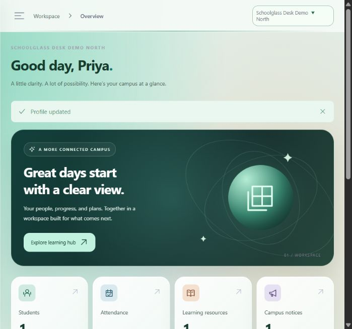
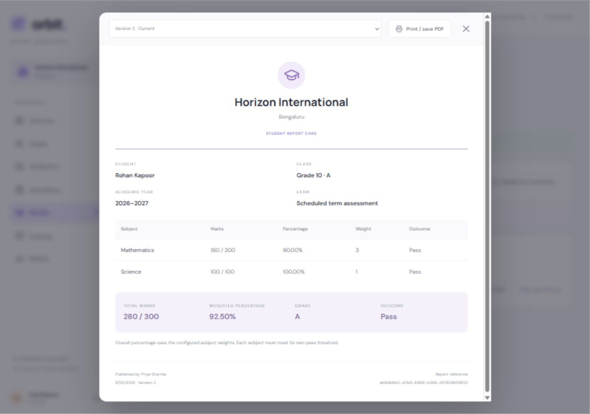

# Schoolglass Desk

A multi-school workspace built with React, Node.js, and MySQL. One API serves the platform console and school web workspace; a mobile client will reuse it later.



## Current delivery

An evolving web implementation with grouped or independent school onboarding, role-based accounts, audited owner support sessions, multi-school switching, academic setup, atomic attendance/marks registers, published weighted report cards, learning resources, assisted password recovery, notices and dashboards. There is no public registration. Production readiness and remaining modules are tracked in the plan.

Phase 2 core academics is implemented, including terms, reviewed promotions/enrollment history, session attendance, PDF report templates, dated timetable substitutions, private attachments, people imports/exports and configurable recovery email. Read [Phase 2 setup and operating details](docs/PHASE-2.md). SMTP delivery and uploads are safely disabled until SMTP and local ClamAV are configured.

## Requirements

- Node.js 22.12+ (Node 24 recommended), npm, Git.
- MySQL 8.4, or Docker with permission to start containers.
- No paid services or API keys required. Docker licensing eligibility depends on the organization; running MySQL Community directly is an alternative.

## Start with MySQL

```powershell
npm install
docker compose up -d
Copy-Item apps/api/.env.example apps/api/.env
# Edit BOOTSTRAP_EMAIL and BOOTSTRAP_PASSWORD before first initialization.
npm run db:init
npm run dev
```

Open http://localhost:5173. Sign in with the bootstrap owner credentials from `apps/api/.env`. Create an organization, school, and leadership account. Sign in as that school's principal/admin to create classes and teacher/student accounts. A director can be assigned multiple schools in the same organization.

MySQL persists in the `orbit_mysql` Docker volume. `docker compose down` stops it without removing data. Do not remove the volume unless you deliberately want to delete the database. The Compose passwords are local development values, not deployment secrets.

## Explore without MySQL

From the root, in PowerShell:

```powershell
$env:DATA_MODE = 'demo'
npm run dev
```

Demo emails: `owner@orbit.local`, `director@orbit.local`, `principal@orbit.local`, `teacher@orbit.local`, `student@orbit.local`. Password: `OrbitDemo123!`. Demo data is ephemeral, visibly labeled, and prohibited when NODE_ENV is production. Unset DATA_MODE to return to MySQL. Demo credentials are independent of the MySQL bootstrap account.

## Academic workflow

The Fees tab provides school fee schedules, concessions, outstanding balances and manual payment receipts. Students see their own ledger only. See [Fee workflow](docs/FEES.md); this records payments and does not process fund transfers.

School management can use People → Admissions and student records for reviewed admission, student profiles, authorized guardian contacts and enrollment history. Students see their own profile only. See [Admissions guide](docs/ADMISSIONS.md). Guardian contacts do not create parent login accounts.

1. A principal/admin opens Academics to create an academic year and grade/section classes.
2. Create teacher/student accounts in People with their class memberships; assign subject teachers in Academics.
3. Configure an exam schedule, subject maximum marks, weights, pass thresholds and grade bands. The defaults are editable examples.
4. Teachers save their assigned subject registers in Results. Each batch succeeds completely or rolls back.
5. Management publishes once every enrolled student has every required subject score. Students see only their own published report.
6. Management can reopen with a reason and republish a new version. Earlier snapshots remain available to management. Reports support browser printing and dedicated PDF download, using publication snapshots of school template settings and typed sign-off names.

Demo mode includes a draft Midterm assessment. Historical unconfigured marks remain available to staff for review.



## Verify

```powershell
npm test
npm run build
npm run db:relational
# Requires configured MySQL; removes its disposable test fixtures.
npm run db:check
```

The 19 backend integration tests cover isolation, roles, recovery, uploads, atomic registers, academic configuration, publication, weighted grading, immutable report versions, independent schools, audited support sessions, timetable conflicts and homework review/revision permissions. The MySQL check verifies rollback and concurrent school transaction serialization.

## Boundaries

Organization is optional when onboarding a school. Independent-school accounts are assigned to one school; grouped directors can retain multiple explicit school memberships. The owner can use People → Open as user to reproduce an issue under the selected account’s permissions, with a reason, visible banner and 30-minute expiry. Saved support changes affect real data and are audited. Account-security changes require the normal administrator session.

Original SVG/CSS assets and system fonts power the design. See [asset provenance](docs/ASSET-PROVENANCE.md) for authorship and naming limitations.

The English working title is configured in `apps/web/src/brand.js`. Dropdowns use styled native pickers in supporting browsers, with a rounded native fallback. People includes Suspend/Reactivate controls: owners manage school accounts; school management can manage assigned teachers, students and staff. Suspension revokes sessions and recovery tokens and blocks login; reactivation requires a fresh login. Support sessions cannot change account status.

People → Edit profile updates an authorized school account’s name, contact number and login email. Email changes need a reason and invalidate sessions/recovery links. Role and membership edits use the separate access workflow. Profile changes are audited; support sessions cannot perform them.

Dialogs use a consistent unblurred dim backdrop and opaque readable surface. Background scrolling is locked while a dialog is open, keyboard focus stays inside, and Escape closes dialogs with a close control. Continuous motion is confined to decorative marks, rings and small indicators, with reduced-motion support.

- MySQL uses versioned relational tables with typed account/academic columns, membership junctions, scoped foreign keys and register uniqueness. Snapshots/optional metadata use JSON extensions. Startup backfills the legacy records table without deleting it. Back up before upgrading; read PHASE-2.md for migration details.
- Sessions and single-use reset tokens persist as hashed records in MySQL and survive API restarts. Demo storage remains ephemeral. Token cleanup, indexed authentication queries and hardened browser token storage remain production work.
- Optional TLS SMTP supports emailed reset/invitation links. Delivery stays disabled until configured. An authorized administrator can still verify the user's identity and privately provide a 15-minute assisted token through People → Recover account. The user opens Forgot password → I have a recovery token. Demo additionally exposes a self-test token.
- Resources accept HTTPS links. PDF/PNG/JPEG uploads of up to 5 MB require configured local ClamAV scanning and storage quota. Missing/failed scanning rejects uploads. Students can attach private files to homework; teachers see them after submission. Files live under ignored `apps/api/data/uploads`; back up this directory with MySQL. Scheduled cleanup removes expired staged/orphan uploads, preserving bound submissions. Files must never be served as public static assets.
- Attendance and configured marks batches are atomic, with at most 200 entries per request. Subject assignments constrain teacher writes. Publication freezes weighted report snapshots; result corrections require reopening and republishing. Terms, reviewed year promotion, session attendance and dedicated PDF export are implemented.
- There is no payment gateway, SMS, WhatsApp, paid AI service, push provider, or hosting subscription.
- API binds to loopback by default. After `npm run build`, `npm start` serves the API and built React frontend at http://127.0.0.1:4000. Production deployment requires an HTTPS reverse proxy, origin policy, environment management, and an appropriate HOST value.

See [the plan](docs/PLAN.md), [architecture](docs/ARCHITECTURE.md), [free-cost strategy](docs/FREE-COST.md), and [work log](docs/WORKLOG.md).

## Timetable

Timetable shows recurring weekly periods and a dated view for academic-year classes. School management creates/edits periods with assigned active teachers, weekday, time range and optional room. Class/teacher/room overlaps are rejected; adjacent periods are allowed. The dated view respects school holidays and supports audited substitutions with teacher conflict checks. Cancel affected substitutions before editing the weekly schedule. Cross-school travel and period publishing remain future work.

## Homework submissions

Students open Learning → Submit homework to send a text answer (up to 10,000 characters). They see only their own attempts and feedback. Assigned-class teachers and school management open Review submissions, provide feedback, and choose Reviewed or Request revision. Every answer is stored as a new version; review history is appended. Teachers review only the latest attempt, and students need a revision request to resubmit reviewed work.

Due dates are validated calendar dates and interpreted as end of day UTC. Late answers are accepted and flagged. Private scanned attachment submissions are implemented, subject to configuration and quotas. School timezone settings, rubrics/scoring, reminders and submission pagination remain future work.

## Staff and leave

Staff employment profiles and independent leave approvals are available in the **Staff** tab. Teachers/supporting staff see their own records; school leadership reviews school requests. See [STAFF-LEAVE.md](docs/STAFF-LEAVE.md) for cancellation rules, audit history and current limits. Payroll is not included.

## Phase 3 operations and families

Library, transport, assets, tickets, visitors, document requests, inbox/read receipts, teacher–guardian messaging and verified linked-child parent access are implemented. Settings include school display branding, regional formats and English/Hindi family labels. See [PHASE-3.md](docs/PHASE-3.md) for onboarding, permissions, migration v9 and current limits. Run `npm run db:operations` against development MySQL for the new relational checks. Phase 4 remains required before real student data.

Notices support multiple class/section targets and assigned teacher publishing. Admission approval can onboard verified guardian accounts together with the student. School logos, branded learning-material downloads and the private event gallery are implemented; logo/gallery uploads remain disabled until local ClamAV is configured. See [SCHOOL-PUBLISHING.md](docs/SCHOOL-PUBLISHING.md).

Phase 4 adds owner-only [platform monitoring](docs/PLATFORM-MONITORING.md) and offline [encrypted backup/recovery tools](docs/BACKUP-RECOVERY.md), with an [incident-response runbook](docs/INCIDENT-RESPONSE.md). `backup:create`, `backup:verify`, `backup:restore` and `db:recovery` are operator commands. Restores require a new isolated database and revoke recovered sessions. The recovery tool has a 128 MB pilot limit; actual deployment recovery acceptance and remaining release gates are listed in PLAN.md.

[Runtime security](docs/RUNTIME-SECURITY.md) separates migration credentials from production API access, protects audit writes and documents the school-isolation review. `db:grants` prints table-specific SQL for operator review; `db:permissions` verifies it with a disposable MySQL account. Production startup always skips migrations; run `db:init` using separate migration credentials before switching to a restricted runtime account.
