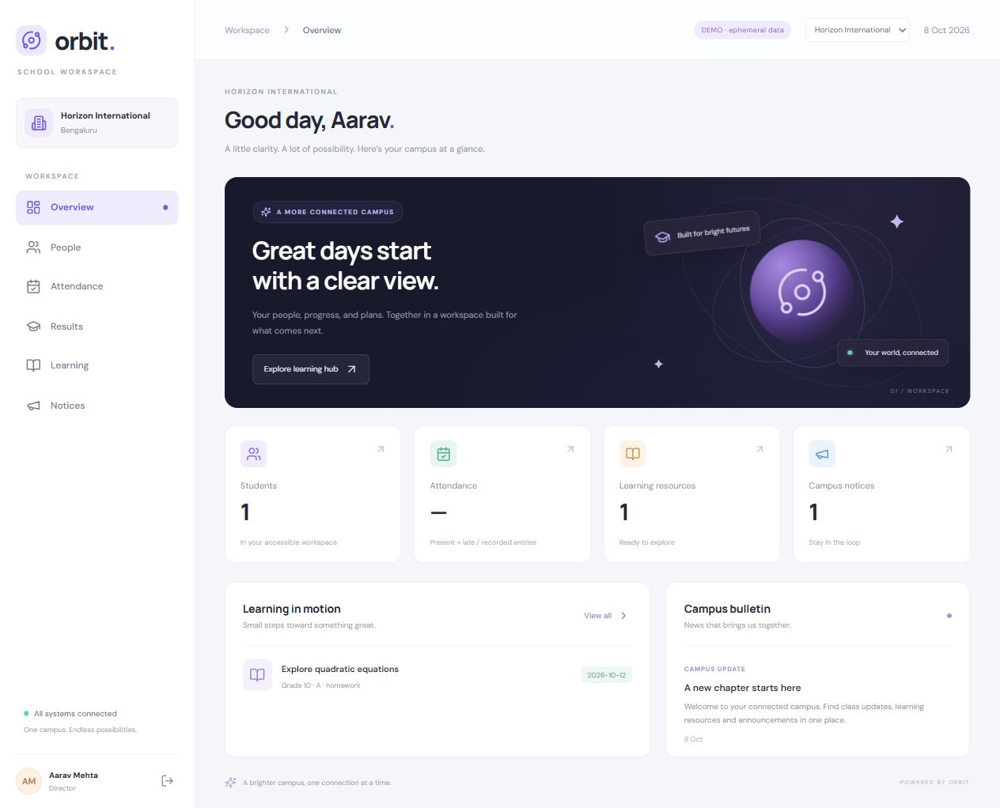

# Orbit School

A multi-school workspace built with React, Node.js, and MySQL. One API serves the platform console and school web workspace; a mobile client will reuse it later.



## Current delivery

An initial working web MVP, not a completed production school ERP. Includes organization/school onboarding, leadership and school user creation, multi-school switching, class creation, attendance and marks tables, provisional totals and printable reports, learning resource links and PDF/image uploads, administrator-assisted password recovery, role/class notices, and dashboards. There is no public registration. Dashboards use actual records, not invented student counts.

## Requirements

- Node.js 22.12+ (Node 24 recommended), npm, Git.
- MySQL 8.4, or Docker with permission to start containers.
- No paid services or API keys required. Docker licensing eligibility depends on the organization; running MySQL Community directly is an alternative.

## Start with MySQL

```powershell
npm install
docker compose up -d
Copy-Item apps/api/.env.example apps/api/.env
# Edit BOOTSTRAP_EMAIL and BOOTSTRAP_PASSWORD before first initialization.
npm run db:init
npm run dev
```

Open http://localhost:5173. Sign in with the bootstrap owner credentials from `apps/api/.env`. Create an organization, school, and leadership account. Sign in as that school's principal/admin to create classes and teacher/student accounts. A director can be assigned multiple schools in the same organization.

MySQL persists in the `orbit_mysql` Docker volume. `docker compose down` stops it without removing data. Do not remove the volume unless you deliberately want to delete the database. The Compose passwords are local development values, not deployment secrets.

## Explore without MySQL

From the root, in PowerShell:

```powershell
$env:DATA_MODE = 'demo'
npm run dev
```

Demo emails: `owner@orbit.local`, `director@orbit.local`, `principal@orbit.local`, `teacher@orbit.local`, `student@orbit.local`. Password: `OrbitDemo123!`. Demo data is ephemeral, visibly labeled, and prohibited when NODE_ENV is production. Unset DATA_MODE to return to MySQL. Demo credentials are independent of the MySQL bootstrap account.

## Verify

```powershell
npm test
npm run build
```

The backend tests exercise school isolation, class visibility, audience notices, privilege escalation protection, grade validation, attendance updates, logout, and password resets.

## Boundaries

- The initial MySQL adapter stores JSON records with indexed type/school columns. It is deliberately a small MVP adapter; production needs normalized tables, foreign keys, transactions, migrations, and database-level uniqueness before real school data.
- Sessions and reset tokens are held in API process memory. Server restart signs everyone out. Use a persistent session store before running multiple API instances.
- Automated email reset delivery is not implemented. In either mode, an authorized administrator opens People → Recover account, verifies the user's identity, and privately provides the 15-minute token. The user opens Forgot password → I have a recovery token. Demo additionally exposes a token for self-testing. Do not represent this as an email integration.
- Resources accept HTTPS links or PDF/PNG/JPEG uploads of up to 5 MB. File signatures are checked and downloads require school/class authorization. Files are stored under ignored `apps/api/data/uploads`; back up this directory with MySQL. Malware scanning, submissions, storage quotas and cleanup are planned. Files must never be served as public static assets. Ephemeral cloud storage is unsuitable for these uploads.
- Marks are entered per student and subject using forms or editable class tables. Provisional exam totals and percentages are available. Register writes are sequential with visible partial-progress errors. Transactional bulk APIs, grading schemes, exam publication, weighted totals, and official report cards are planned.
- There is no payment gateway, SMS, WhatsApp, paid AI service, push provider, or hosting subscription.
- API binds to loopback by default. After `npm run build`, `npm start` serves the API and built React frontend at http://127.0.0.1:4000. Production deployment requires an HTTPS reverse proxy, origin policy, environment management, and an appropriate HOST value.

See [the plan](docs/PLAN.md), [architecture](docs/ARCHITECTURE.md), [free-cost strategy](docs/FREE-COST.md), and [work log](docs/WORKLOG.md).
